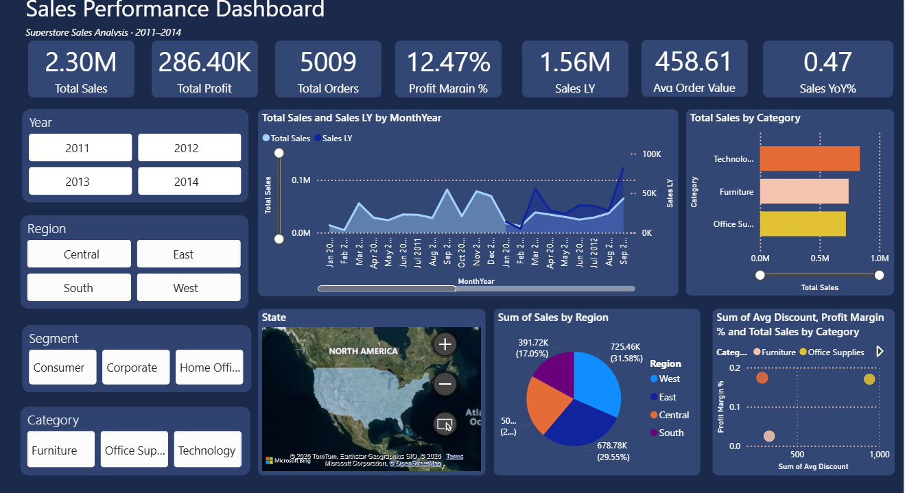

# 📊 Sales Performance Dashboard

> **Superstore Sales Analysis · 2011–2014**  
> An interactive Power BI dashboard providing end-to-end visibility into sales performance, profitability, regional distribution, and category-level insights across a 4-year period.



---

## 📁 Project Structure

```
sales-performance-dashboard/
├── README.md
├── dashboard_screenshot.png
├── SalesPerformanceDashboard.pbix     # Power BI report file
└── data/
    └── superstore_sales_2011_2014.csv # Source dataset
```

---

## 🎯 Objective

This dashboard was built to help business stakeholders monitor key sales metrics, identify trends over time, compare regional performance, and assess profitability across product categories — all from a single, interactive view.

---

## 🔢 KPI Cards (Top Summary Row)

The top row contains **7 high-level KPI cards**, each representing a critical business metric at a glance:

| KPI | Value | Description |
|-----|-------|-------------|
| **Total Sales** | 2.30M | Cumulative revenue generated across all years, regions, segments, and categories |
| **Total Profit** | 286.40K | Net profit after costs, summed across the entire dataset |
| **Total Orders** | 5,009 | Total number of individual orders placed in the period |
| **Profit Margin %** | 12.47% | Overall profitability ratio — profit as a percentage of total sales |
| **Sales LY** | 1.56M | Sales from Last Year (previous year relative to current filter context) used for YoY comparison |
| **Avg Order Value** | 458.61 | Average revenue generated per order (Total Sales ÷ Total Orders) |
| **Sales YoY%** | 0.47% | Year-over-Year percentage growth in sales |

> **Design Note:** All KPIs are dynamic and respond to the Year, Region, Segment, and Category slicers on the left panel.

---

## 🔽 Slicers (Filter Panel — Left Side)

The left panel contains **4 slicer groups** that allow users to interactively filter the entire dashboard. All visuals cross-filter based on selections made here.

### 📅 Year Slicer
- **Type:** Multi-select button slicer
- **Values:** 2011 | 2012 | 2013 | 2014
- **Purpose:** Filter all dashboard visuals to one or more specific years. Enables year-specific performance analysis or multi-year trend comparisons.

### 🗺️ Region Slicer
- **Type:** Multi-select button slicer
- **Values:** Central | East | South | West
- **Purpose:** Isolate performance metrics by US geographic region. Useful for regional managers to view their own territory or compare regions side by side.

### 👥 Segment Slicer
- **Type:** Multi-select button slicer
- **Values:** Consumer | Corporate | Home Office
- **Purpose:** Filter by customer segment. Helps identify which segment contributes most to revenue and profit, and how different segments behave across regions or categories.

### 📦 Category Slicer
- **Type:** Multi-select button slicer
- **Values:** Furniture | Office Supplies | Technology
- **Purpose:** Drill into product category performance. Allows category managers to view sales, profit, and trends specific to their product lines.

---

## 📈 Charts & Visualizations

### 1. Total Sales and Sales LY by Month-Year *(Line Chart — Center Top)*

- **Type:** Dual-axis line chart
- **X-Axis:** Month-Year (Jan 2011 – Dec 2012 shown, scrollable)
- **Left Y-Axis:** Total Sales (0.0M – 0.1M+)
- **Right Y-Axis:** Sales LY — Last Year's Sales (0K – 100K)
- **Series:**
  - 🔵 **Total Sales** — current period sales plotted as a light blue area/line
  - 🔷 **Sales LY** — prior year sales plotted as a dark blue line for comparison
- **Purpose:** Tracks month-by-month revenue trends and benchmarks current sales against the same period in the prior year. Seasonal peaks and growth acceleration are clearly visible in the later months.
- **Interaction:** Responds to all slicers. A scroll bar at the bottom allows navigation across the full 4-year timeline.

---

### 2. Total Sales by Category *(Horizontal Bar Chart — Top Right)*

- **Type:** Horizontal bar chart
- **X-Axis:** Total Sales (0.0M – 1.0M)
- **Y-Axis:** Product Category
- **Bars:**
  - 🟠 **Technology** — highest sales (~0.85M)
  - 🍑 **Furniture** — mid-range sales (~0.75M)
  - 🟡 **Office Supplies** — competitive sales (~0.70M)
- **Purpose:** Provides a quick visual comparison of revenue contribution by product category. Technology leads in absolute sales, but profitability context is available in the scatter chart below.
- **Interaction:** Clicking a bar cross-filters all other visuals on the page. The slider at the bottom allows filtering by sales range.

---

### 3. State Map *(Filled/Bubble Map — Center Bottom)*

- **Type:** Geographic map (Bing Maps integration)
- **Region:** North America (USA focus)
- **Purpose:** Displays sales distribution geographically by US state. States with higher sales show more prominent visual indicators, making it easy to spot high-performing and underperforming states.
- **Interaction:** Clicking on a state filters the dashboard to that state's data. Supports zoom in/out using the `+` / `−` controls.

---

### 4. Sum of Sales by Region *(Pie/Donut Chart — Center Bottom)*

- **Type:** Pie chart
- **Segments & Values:**
  | Region | Sales | Share |
  |--------|-------|-------|
  | 🔵 West | 725.46K | 31.58% |
  | 🟠 Central | 678.78K | 29.55% |
  | 🟣 South | 391.72K | 17.05% |
  | 🔴 East | ~50X.XXK | ~21.82% |
- **Purpose:** Visualizes the proportional contribution of each region to total sales. West and Central together account for over 60% of total sales, indicating high geographic concentration.
- **Interaction:** Clicking a pie slice filters the full dashboard to that region, acting as an additional slicer.

---

### 5. Sum of Avg Discount, Profit Margin % and Total Sales by Category *(Scatter Chart — Bottom Right)*

- **Type:** Scatter plot
- **X-Axis:** Sum of Avg Discount (0 – 1,000)
- **Y-Axis:** Profit Margin % (0.0 – 0.2)
- **Bubble Size:** Total Sales (larger bubble = higher sales)
- **Color Legend:**
  - 🟠 **Furniture**
  - 🟡 **Office Supplies**
  - *(Technology visible when category filter is active)*
- **Purpose:** This is the most analytical visual on the dashboard. It reveals the **relationship between discount levels, profit margins, and sales volume** per category. Categories with high discounts and low margins are immediately identifiable as potential profitability risks.
- **Key Insight:** Categories positioned top-left (low discount, high margin) are the most profitable. Bottom-right positioning (high discount, low margin) indicates margin erosion due to discounting.
- **Interaction:** Responds to all slicers; a play-axis button (▶) on the right may animate data across years.

---

## 🔗 Cross-Filter Interactions

All visuals on this dashboard are interconnected. Selecting any data point — a region in the pie chart, a category bar, a year slicer button — will **dynamically filter every other visual** on the page simultaneously. This enables:

- Drill-down analysis without navigating to a new page
- Ad-hoc slice-and-dice exploration
- Instant comparison across dimensions

---

## 🛠️ Tools & Technologies

| Tool | Usage |
|------|-------|
| **Microsoft Power BI Desktop** | Dashboard development & publishing |
| **Power Query (M Language)** | Data ingestion, transformation, and cleaning |
| **DAX (Data Analysis Expressions)** | KPI measures: Total Sales, Profit Margin %, Sales LY, YoY% |
| **Bing Maps** | Geographic state-level map visual |
| **Superstore Dataset** | Sample retail dataset (2011–2014) |

---

## 📐 Key DAX Measures

```dax
-- Total Sales
Total Sales = SUM(Orders[Sales])

-- Total Profit
Total Profit = SUM(Orders[Profit])

-- Profit Margin %
Profit Margin % = DIVIDE([Total Profit], [Total Sales], 0)

-- Sales Last Year
Sales LY = CALCULATE([Total Sales], SAMEPERIODLASTYEAR('Date'[Date]))

-- Sales YoY %
Sales YoY% = DIVIDE([Total Sales] - [Sales LY], [Sales LY], 0)

-- Average Order Value
Avg Order Value = DIVIDE([Total Sales], DISTINCTCOUNT(Orders[Order ID]), 0)
```

---

## 🚀 How to Use

1. **Clone this repository**
   ```bash
   git clone https://github.com/your-username/sales-performance-dashboard.git
   ```

2. **Open the report**  
   Open `SalesPerformanceDashboard.pbix` in [Power BI Desktop](https://powerbi.microsoft.com/desktop/).

3. **Refresh data** *(if using live data source)*  
   Go to `Home → Transform Data → Refresh` or update the data source path in Power Query.

4. **Interact with slicers**  
   Use the Year, Region, Segment, and Category slicers on the left to filter the dashboard dynamically.

5. **Publish to Power BI Service** *(optional)*  
   Go to `Home → Publish` and select your Power BI workspace to share with stakeholders.

---

## 📊 Key Insights from the Dashboard

- **Technology** leads in total sales volume, making it the highest-revenue category.
- **West** is the top-performing region, contributing ~31.58% of total sales.
- Sales show a clear **upward trend** over the 4-year period with notable end-of-year peaks (holiday seasonality).
- **Profit Margin at 12.47%** suggests moderate profitability — deeper analysis via the scatter chart can identify categories dragging margins down through excessive discounting.
- **Consumer segment** is typically the largest by volume in superstore datasets, though segments can be isolated via the slicer.

---

## 📄 License

This project is for educational and portfolio purposes. The Superstore dataset is a sample dataset widely used for BI demonstrations.

---

## 🙋 Author  
[GitHub](https://github.com/Vaishali-Sonkar) · [LinkedIn](https://www.linkedin.com/in/vaishali-sonkar-b83a87314/)

> Feel free to ⭐ star this repository if you found it useful!
